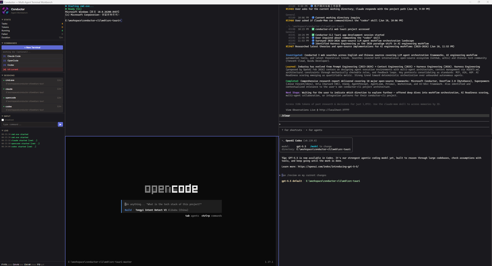

# Conductor

Windows Agent Workbench — 基于 Electron 的多 Agent 终端工作台。



## 功能全景

- **Electron 桌面窗口** — Electron 40 + electron-vite 4，原生系统托盘
- **PTY Daemon 架构** — 独立 Node.js 进程管理所有 PTY，Named Pipe IPC 通信
- **CLI 命令行** — 全局 `conductor` 命令，管理 daemon/sessions/worktree/agents
- **可配置 Agent** — `agents.json` 配置任意 Agent 类型和启动命令
- **会话恢复** — Claude Code / OpenCode / Codex 关闭重开后自动恢复上次会话
- **Git Worktree 隔离** — 每个 Agent 会话独立 worktree，代码修改不冲突
- **多 Agent PTY** — 同时运行 Claude Code / OpenCode / Codex / cmd.exe 及自定义 Agent
- **动态格网布局** — 1=全屏, 2=双列, 3=2+1跨行, 4=2×2, 5=2×2+跨行, 6+=3列
- **工作目录** — 新建终端时指定起始目录
- **广播模式** — 同时向所有终端发送输入
- **文本选择** — 鼠标拖选 + Ctrl+Shift+C 复制
- **终端搜索** — Ctrl+F 搜索终端内容
- **Git 分支检测** — 自动检测工作目录的 Git 分支并显示在面板
- **Dashboard** — 实时统计、通知、任务队列
- **SQLite 持久化** — better-sqlite3 存储会话历史和输出日志
- **进程清理** — 窗口关闭时自动终止所有子 PTY 进程
- **全彩色** — xterm.js Canvas 渲染，256 色

---

## 快速开始

### 环境要求

- Windows 10/11
- [Node.js](https://nodejs.org/) 18+
- Git（用于 worktree 功能）

### 安装与运行

```bash
git clone <repo-url>
cd conductor-cli
npm install
npm run dev
```

启动后打开原生 Windows 窗口，默认加载 `cmd.exe` 终端面板。PTY Daemon 会自动启动。

### 构建与打包

```bash
npm run build       # 编译 Electron + Daemon + CLI
npm run package     # 打包 .exe 安装程序
```

---

## CLI 命令

Conductor 自带全局命令行工具 `conductor`（类似 `claude` / `codex`），管理 daemon、会话、worktree、agents 配置和启动应用。

### 安装

```bash
npm link          # 在仓库内执行一次，注册全局 `conductor` 命令
conductor version # 之后任意目录可用
```

### 命令一览

```bash
conductor                              # 显示帮助
conductor version                      # 版本 + 协议版本
conductor status                       # 总览：daemon 状态 + 版本
conductor doctor                       # 环境健康检查
conductor open                         # 启动 Electron 应用（dev）

conductor daemon status                # daemon PID、协议版本、活跃会话
conductor daemon start                 # 启动 daemon（detached，后台）
conductor daemon stop                  # 停止 daemon（按 PID 文件发 SIGTERM）
conductor daemon restart               # 停止 + 启动（让重建后的 daemon 生效）
conductor daemon logs [--follow]       # 查看 daemon 日志

conductor sessions list                # 活跃 PTY 会话
conductor sessions kill <sessionId>    # 杀掉指定会话

conductor worktree list                # 列出 worktree（标记 ACTIVE/DIRTY）
conductor worktree cleanup [--force]   # 清除非活跃 worktree

conductor agents list                  # 列出 agents.json
conductor agents add --id <> --name <> --command <> [--create <>] [--resume <>] [--worktree] [--base-branch <>]
conductor agents remove <id>
conductor agents edit <id> <field> <value>     # field: name|command|create|resume
```

### 实际输出示例

**`conductor version`**
```
conductor 2.0.0 (protocol v1)
```

**`conductor status`**
```
conductor 2.0.0 (protocol v1)
Daemon: running (pid=39580, 8 session(s))
```

**`conductor doctor`**
```
conductor 2.0.0 doctor
  [OK] node: v24.14.0
  [OK] package: v2.0.0 at E:\workspace\conductor-cli
  [OK] agents.json: 4 agent(s) at C:\Users\Administrator\AppData\Roaming\conductor\agents.json
  [OK] daemon: running, 8 session(s)
  [OK] git: git version 2.53.0.windows.2
  [OK] worktrees: 4 worktree(s) under C:\Users\Administrator\.conductor\worktrees
  [OK] electron: found (dev)
```

**`conductor sessions list`**
```
Active sessions (8):
  S1  claude    pid=49256  running=true
           agentSessionId=4faa0654-9a67-4f05-b64c-5b12f5234c13
           cwd=E:\workspace\conductor-cli
  S2  opencode  pid=62352  running=true
           agentSessionId=ses_13b1615deffe5uXkzNbhLJquB2
           cwd=E:\workspace\conductor-cli
  ...
```

**`conductor worktree list`**
```
Worktrees (4) under C:\Users\Administrator\.conductor\worktrees:
  [ACTIVE] C:\Users\Administrator\.conductor\worktrees\218f23bc1f3c\claude-20260615-2cec1f16
           branch=conductor/claude/mqemdw27
  [ACTIVE] C:\Users\Administrator\.conductor\worktrees\218f23bc1f3c\claude-20260615-44a87e9c
           branch=conductor/claude/mqemdmb5
  ...
```

### daemon 重启工作流（最常用）

daemon 是后台独立进程，**改了 daemon 代码后不会自动热加载**。让重建生效：

```bash
npm run build:daemon     # 重编译 dist/daemon/*（和 dist/cli/*）
conductor daemon restart # 停旧 daemon → 起新 daemon（读最新 dist）
```

- `restart` = `stop` + `start`。`stop` 按 PID 文件发 SIGTERM，daemon 优雅退出；`start` 轮询命名管直到就绪。
- 若 Electron 应用正在运行：`stop` 后应用的 `DaemonClient` 会在 1 秒内自动重连/重启 daemon。
- **替代手动 `taskkill /PID`** —— 一行 `conductor daemon restart` 搞定。
- 若 `status` 显示「running (no pid file)」：daemon 是 PID 文件特性之前的旧进程，`restart` 一次后即正常。

### 配置变更生效

`agents add/remove/edit` 改的是 `%APPDATA%\conductor\agents.json`，但 daemon 和应用都在**启动时**载入，改完需 `conductor daemon restart` 才生效。

### 与 .exe 打包版的关系（不冲突）

CLI（npm 渠道，需 Node，面向开发者）与 .exe（electron-builder，终端用户，无 Node）是两个独立渠道，终端用户装 .exe 不会有 CLI。两者共享命名管 `\\.\pipe\conductor-pty-daemon`（单主，不双 daemon）和 `%APPDATA%\conductor` userData；`conductor daemon stop` 停的就是应用拉起的那个 daemon（应用随后自动重连）。

---

## 架构

```
┌─────────────────────────────────────────────────────────────────┐
│                    Conductor V2 Architecture                     │
├─────────────────────────────────────────────────────────────────┤
│                                                                  │
│  ┌──────────────────────┐    Named Pipe    ┌──────────────────┐ │
│  │   PTY Daemon (Node)  │◄════════════════►│ Electron Main    │ │
│  │                      │  \\.\pipe\       │                  │ │
│  │  ┌─ PtyManager ────┐ │  conductor-pty-  │  ┌─ DaemonClient┐ │ │
│  │  │ node-pty spawn  │ │  daemon          │  │  reconnect   │ │ │
│  │  │ session map     │ │                  │  └──────────────┘ │ │
│  │  │ 64KB ring buffer│ │                  │  ┌─ WindowManager┐ │ │
│  │  └────────────────┘ │                  │  │  窗口/托盘    │ │ │
│  │  ┌─ SessionStore ──┐ │                  │  └──────────────┘ │ │
│  │  │ agent_session_id│ │                  │  ┌─ StatsCollector┐│ │
│  │  │ recovery        │ │                  │  │  Token/Health │ │ │
│  │  └────────────────┘ │                  │  └──────────────┘ │ │
│  │  ┌─ WorktreeMgr ──┐ │                  │  ┌─ NotifyCenter ─┐ │ │
│  │  │ create/cleanup  │ │                  │  │  通知/解析     │ │ │
│  │  │ rollback        │ │                  │  └──────────────┘ │ │
│  │  └────────────────┘ │                  │  ┌─ WorktreeMgr ──┐ │ │
│  └──────────────────────┘                  │  │ create/cleanup │ │ │
│                                            │  └──────────────┘ │ │
│  ┌──────────────────────┐                  └──────────────────┘ │
│  │  CLI (conductor)     │                          │ IPC         │
│  │  daemon/sessions/    │                          ▼             │
│  │  worktree/agents     │            ┌──────────────────────┐  │
│  └──────────────────────┘            │  Electron Renderer   │  │
│                                      │                      │  │
│  ┌──────────────────────┐            │  React + xterm.js    │  │
│  │  ~/.conductor/        │            │  CSS Grid 动态布局    │  │
│  │    worktrees/         │            │  Sidebar + 通知面板   │  │
│  │    agents.json        │            │  Dashboard + Tasks    │  │
│  └──────────────────────┘            └──────────────────────┘  │
└─────────────────────────────────────────────────────────────────┘
```

**核心组件：**

- **PTY Daemon** — 独立 Node.js 进程，管理所有 PTY 会话，通过 Named Pipe 与 Electron 主进程通信
- **Electron Main** — 窗口管理、DaemonClient（自动重连）、StatsCollector、NotifyCenter、WorktreeManager
- **Electron Renderer** — React + xterm.js，CSS Grid 动态布局，Zustand 状态管理
- **CLI** — 命令行工具，管理 daemon、会话、worktree、agents 配置

---

## 项目结构

```
conductor-cli/
├── src/
│   ├── cli/                  # CLI 命令行工具
│   │   ├── index.ts          # 入口路由
│   │   ├── cmd/              # 子命令实现
│   │   │   ├── app.ts        # version/status/doctor/open
│   │   │   ├── daemon.ts     # daemon start/stop/restart/logs
│   │   │   ├── sessions.ts   # sessions list/kill
│   │   │   ├── worktree.ts   # worktree list/cleanup
│   │   │   └── agents.ts     # agents list/add/remove/edit
│   │   ├── daemon-client.ts  # Named Pipe 客户端
│   │   ├── paths.ts          # 路径常量
│   │   └── pid.ts            # PID 文件管理
│   ├── daemon/               # PTY Daemon 进程
│   │   ├── main.ts           # Daemon 入口
│   │   ├── server.ts         # Named Pipe 服务器
│   │   ├── pty-manager.ts    # node-pty 封装
│   │   ├── session-store.ts  # 会话持久化
│   │   └── session-recovery.ts # Agent session ID 发现
│   ├── main/                 # Electron 主进程
│   │   ├── index.ts          # 应用入口
│   │   ├── daemon-client.ts  # Daemon 客户端（自动重连）
│   │   ├── stats-collector.ts # 数据统计
│   │   ├── notify-center.ts  # 通知中心
│   │   ├── task-queue.ts     # 任务队列
│   │   ├── worktree-manager.ts # Git worktree 管理
│   │   └── ipc-handlers.ts   # IPC 处理
│   ├── renderer/             # Electron 渲染进程
│   │   ├── App.tsx           # 主应用
│   │   ├── components/       # React 组件
│   │   └── store/            # Zustand 状态
│   └── preload/              # Preload 脚本
├── bin/
│   └── conductor.js          # npm bin 入口
├── tests/                    # 测试
│   ├── scenarios/            # E2E 测试场景
│   └── *.test.ts             # 单元测试
├── docs/                     # 文档
├── conductor.cmd             # Windows 便利脚本（调用 bin/conductor.js）
└── package.json
```

---

## Agent 配置

`agents.json` 位于 `%APPDATA%\conductor\agents.json`，首次启动自动生成默认配置。

```json
{
  "agents": [
    { "id": "cmd", "name": "Command Prompt", "command": "cmd.exe", "args": [], "builtin": true },
    { "id": "claude", "name": "Claude Code", "command": "claude", "args": [], "builtin": false },
    { "id": "opencode", "name": "OpenCode", "command": "opencode", "args": [], "builtin": false },
    { "id": "codex", "name": "Codex", "command": "codex", "args": [], "builtin": false }
  ]
}
```

添加自定义 Agent：

```json
{
  "id": "my-agent",
  "name": "My Company Agent",
  "command": "D:\\tools\\agent.exe",
  "args": ["--interactive", "--workspace"],
  "builtin": false
}
```

| 字段 | 说明 |
|------|------|
| `id` | 唯一标识，对应 spawn 命令 |
| `name` | 侧边栏显示名称 |
| `command` | 可执行文件路径或命令名 |
| `args` | 启动参数（可选） |
| `create_template` | 新建会话模板，`{session_id}` 替换为 Conductor 生成的 UUID |
| `resume_template` | 恢复会话模板，`{session_id}` 替换为 Agent 真实 session ID |
| `setup` | 启动前执行的命令数组（如 `["npm install"]`） |
| `worktree` | 是否启用 git worktree 隔离（`true`/`false`） |
| `builtin` | `true` = 始终显示；`false` = PATH 检测到才显示 |

**会话恢复示例**：

```json
{
  "id": "claude",
  "create_template": "--session-id {session_id}",
  "resume_template": "--resume {session_id}"
}
```
- 新建时：`claude --session-id <uuid>`
- 恢复时：`claude --resume <captured-id>`

**各 Agent 的恢复机制**：

| Agent | 发现机制 | 恢复命令 |
|-------|---------|---------|
| Claude Code | stdout 正则捕获 `Session ID: <uuid>` | `--resume {uuid}` |
| OpenCode | `opencode db "SELECT id FROM session"` | `--session {ses_xxx}` |
| Codex | 扫描 `~/.codex/sessions/` 目录 | `resume --last` |

---

## Git Worktree 隔离

Conductor 支持为每个 Agent 会话创建独立的 git worktree，实现代码修改隔离。

### 工作原理

1. Agent 配置中启用 `worktree: true`
2. 新建会话时，自动在 `~/.conductor/worktrees/<project-hash>/` 创建 worktree
3. Agent 在 worktree 中工作，不影响主仓库
4. 会话结束时，可选择合并、保留或删除 worktree

### 配置

在 `agents.json` 中为 Agent 启用 worktree：

```json
{
  "id": "claude",
  "name": "Claude Code",
  "command": "claude",
  "worktree": true
}
```

### 管理

```bash
conductor worktree list                # 列出所有 worktree
conductor worktree cleanup             # 清理非活跃 worktree
conductor worktree cleanup --force     # 强制清理（包括有未提交改动的）
```

---

## Dashboard

Electron 应用内置 Dashboard，实时显示系统状态：

- **Stats** — Tasks / Tokens / Running / Failed / Duration
- **Sessions** — 会话卡片：状态圆点、Agent、运行时长、工作目录、Git 分支
- **Notify** — 通知面板：Agent 输出事件流
- **Tasks** — 任务队列：待执行/执行中/已完成的任务

---

## 基本操作

| 操作 | 方式 |
|------|------|
| 新建终端 | 侧边栏 `+ New Terminal` 或 `Ctrl+N` |
| 指定工作目录 | 侧边栏 `working dir` 输入框填入路径后新建 |
| 关闭终端 | 侧边栏 `kill current` 或 `Ctrl+W` |
| 切换面板 | `F1`-`F9` |
| 广播输入 | 勾选 `broadcast`，输入命令后点 `▶` |
| 复制文字 | 鼠标拖选 + `Ctrl+Shift+C` 或右键 |
| 退出 | `F10` |

---

## 技术栈

| 层 | 技术 |
|----|------|
| 桌面壳 | Electron 40, electron-vite 4 |
| PTY 管理 | node-pty 1.x (ConPTY)，独立 Daemon 进程 |
| IPC | Named Pipe，4-byte length-prefixed JSON frames |
| 前端 | React 19, xterm.js 6, Zustand |
| 布局 | CSS Grid（动态格网算法） |
| 存储 | SQLite (better-sqlite3) |
| Git | simple-git |
| CLI | 手写 argv parser（无依赖） |
| 配置 | JSON（agents.json，%APPDATA%\conductor\） |
| 样式 | CSS 自定义属性 + WebKit 滚动条 |

---

## 快捷键

| 按键 | 功能 |
|------|------|
| `F1`-`F9` | 切换到第 N 个面板 |
| `Ctrl+N` | 新建终端 |
| `Ctrl+W` | 关闭当前面板 |
| `Ctrl+Shift+C` | 复制选中文字 |
| `Ctrl+F` | 终端内搜索 |
| `Ctrl+K` / `Ctrl+L` | 清屏 |
| `F10` | 退出 |

---

## 开发指南

### 开发流程

```bash
# 1. 启动开发模式（自动编译 daemon + CLI，启动 Electron）
npm run dev

# 2. 修改 daemon 代码后，需要重建并重启 daemon
npm run build:daemon
conductor daemon restart

# 3. 修改 renderer 代码，Vite 热重载自动生效

# 4. 构建生产版本
npm run build

# 5. 打包 .exe 安装程序
npm run package
```

### 测试

```bash
# 运行所有测试
npm test

# 运行 E2E 测试
npm run test:e2e

# 监听模式
npm run test:watch
```

### 调试

```bash
# 查看 daemon 日志
conductor daemon logs --follow

# 环境健康检查
conductor doctor

# 查看 daemon 状态
conductor daemon status
```

---

## 常见问题

**Q: 修改 daemon 代码后不生效？**

A: daemon 是独立进程，需要重建并重启：
```bash
npm run build:daemon
conductor daemon restart
```

**Q: `conductor status` 显示「running (no pid file)」？**

A: daemon 是 PID 文件特性之前的旧进程，`restart` 一次后即正常。

**Q: 如何彻底清理所有 Conductor 进程？**

A: 
```bash
conductor daemon stop        # 停止 daemon
conductor kill               # 停止所有 Electron 进程
```

**Q: worktree 占用磁盘空间？**

A: 定期清理：
```bash
conductor worktree cleanup   # 清理非活跃 worktree
```

---

## License

MIT
